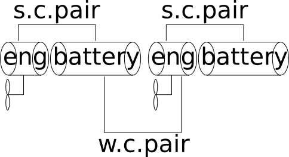
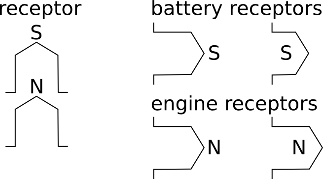
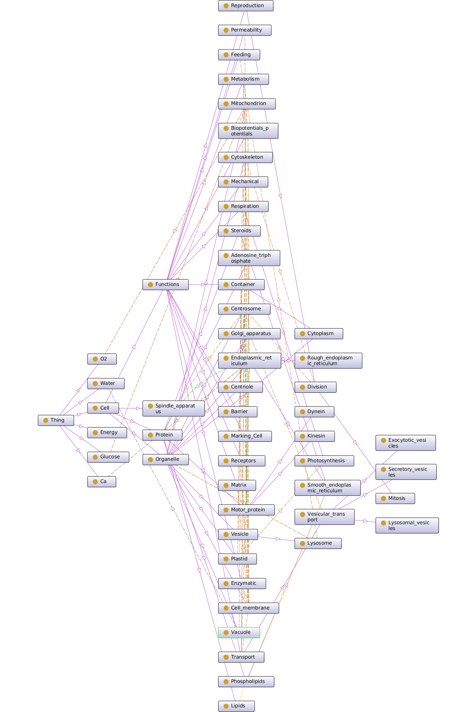

#Design specification for the self-replicating robots 2D

First of all we plan to create something like 10 - 50 of components of two types:

- engines with water propeller
- batteries

Both engines and batteries will be placed in water proof and floating plastic containers.

- eng - engine with propeller to enable stochastic swimming on the watere surface.
- battery - the battery to power the engine.

The electrical contact from the battery to the engine is provided via magnetic device
called 'receptor', depicted below:

Receptor provides the electrical contact only to the device of one to another within specific place.
The magnets depicted as N and S provides weak and breakable connection of one component to another.
In case of the battery there could be two types of connection pairs: weak (w.c.pair) and strong
(s.c.pair). Strong connection pair guarantees the connection of moving pair to be exceed the
week connection pair.

