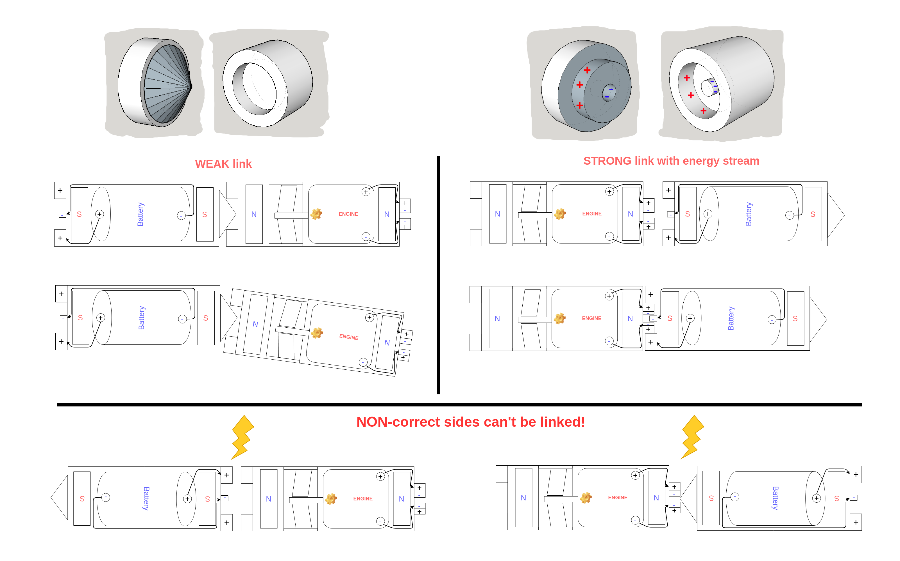

#Design specification for the self-replicating robots 2D

## RNA robots

First of all we plan to create something like 10 - 50 of components of two types:

- engines with water propeller
- batteries

Both engines and batteries will be placed in water proof and floating plastic containers.

- eng - engine with propeller to enable stochastic swimming on the watere surface.
- battery - the battery to power the engine.

The electrical contact from the battery to the engine is provided via magnetic device
called 'receptor', depicted below:

Receptor provides the electrical contact only to the device of one to another within specific place.
The magnets depicted as N and S provides weak and breakable connection of one component to another.
In case of the battery there could be two types of connection pairs: weak (w.c.pair) and strong
(s.c.pair). Strong connection pair guarantees the connection of moving pair to be exceed the
week connection pair.

All this components should be placed on the water surface and initiated with some stochastic movement
that could be water mix or we could initiate first pair. After some time of stochastic movement of the par(s), that could be understood as Brownian motion there should be some significant growth of the pairs replicated by first pair. The replication is done in the following way:

1. the first pair battery connects to a new engine without electrical contact via receptor of w.c.pair
1. the new engine later connects to a new battery via receptor of s.c.pair
1. the new engine starts that increases the speed of the two pairs
1. due to collisions the two pairs breaks in the w.c.pair connection forming new replicated pair

After some time repetition of the steps described above, there should be some significant
growth of pairs.

##3D design

##Motor

http://www.bgmicro.com/12v-motor-with-governor.aspx

## Cells ontology inspiring for cell bots

